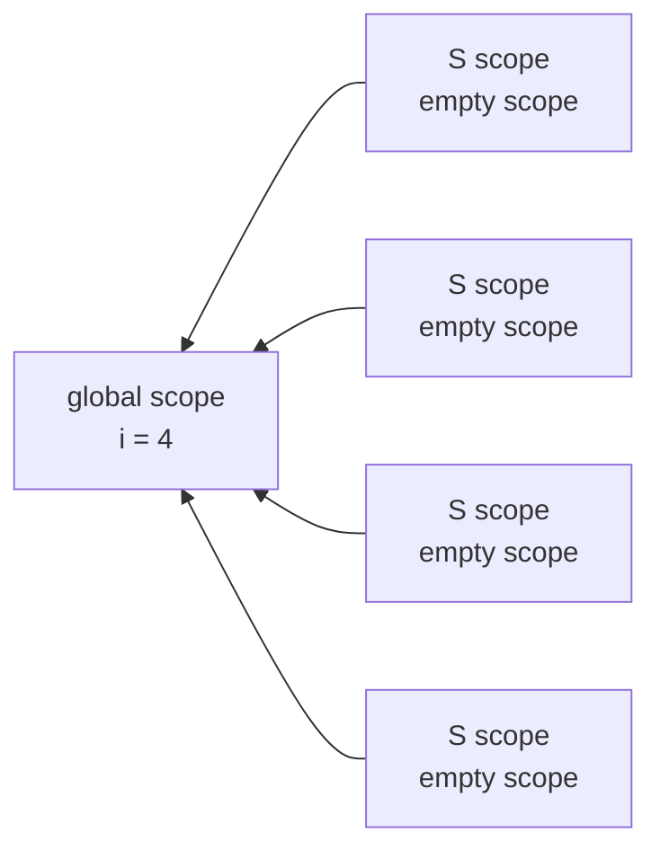
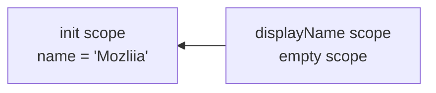
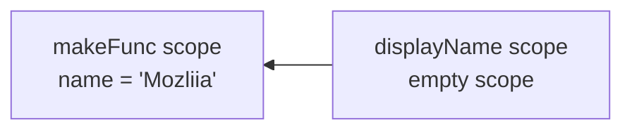

## Scope

> 스코프란 현재 접근할 수 있는 변수들의 범위

* `setTimout`이 비동기로 작동되어 `for`문이 모두 마치고서 `setTimout`이 실행된다.
* 예를 들어, `for`문이 돌때마다 `setTimeout`은 이벤트 큐에 계속 추가 된다.
* `for`문이 끝난 뒤 이벤트 큐에 있는 `setTimeout`이 순서대로 실행 된다.(이때 엄청 빠른 속도로 이벤트큐에 쌓인다.)
* 이때 `setTimeout`에는 `i`값을 갖고 있는데 `for`문이 다 끝나고 나면 `i`의 값은 4이므로 4가 출력된다.
* 참조 : [자바스크립트-런타임](https://shldhee.github.io/2017/12/21/javascript-runtime/)

*이슈 소스 예제*

``` js
for(var i = 0; i < 4; i++) {
  setTimeout(function (){
    console.log(i);
  }, 1000)
}

// result
// 4
// 4
// 4
// 4
```

* `i`는 글로벌 스코프이고 `setTimeout`안에 함수 스코프(`S`라고 한다.)가 `for`문을 돌때마다 생긴다.
* 이때 생기는 `S`스코프와 글로벌 스코프의 스코프 체인(scope-chain)이 만들어 진다.



*수정 코드*

``` js
for(i = 0; i < 4; i++) {
	setTimeout((function(i){
    return function(){
      console.log(i);
    }
  })(i), 1000)
```

## 어휘적 유효 범위 (Lexical scoping)

* 내부 함수는 외부 함수에 접근할 권한을 가지고 있다. (`displayName()`는 부모함수 `init()`에 선언된 변수 `name`에 접근)


``` js
function init() {
  var name = "Mozilla"; // name은 init의 지역변수
  function displayName() { // displayName()은 내부 함수, 클로저
    alert(name); // 부모 함수(init())에서 선언된 변수 사용
  }
  displayName();
}
init();
```



## Closure

>"특정 함수가 참조하는 변수들이 선언된 렉시컬 스포트(lexical scope)는 계속 유지되는데, 그 함수와 스코프를 묶어서 클로저라고 한다."
>외부함수(포함하고 있는)의 변수에 접근할 수 있는 내부 함수를 일컫습니다.
>자신의 범위(Scope) 밖에 있는 변수들에 접근할 수 있는 함수를 의미합니다.

*closure(클로저) 예제*

``` js
function makeFunc() {
  var name = "Mozliia";
  function displayName() {
    alert(name);
  }
  return displayName;
}

var myFunc = makeFunc();
myFunc();
```

* `makeFunc()` 실행시 선언될때 스코프 체인을 기억한다.



* 몇몇의 프로그래밍 언어들은 함수 안의 지역 변수들은 그 함수가 수행되는 기간 동안에만 존재한다.
* `makeFunc()` 실행이 끝나면 `name`변수에 더 이상 접근할 수 없게 될 것으로 예상하는 것이 합리적이다.
* 위 코드는 `name`변수의 접근이 가능하다.
* **그 이유는 자바스크립트의 클로저 때문이다.**
* 위의 경우, `myFunc`은 `makeFunc`이 실행될 때 생성된 `displayName` 함수의 인스턴스에 대한 참조다.

*다른 closure 예제*

``` js
function makeAdder(x) {
  return function(y) {
    return x + y;
  };
}

var add5 = makeAdder(5);
var add10 = makeAdder(10);

console.log(add5(2));  // 7
console.log(add10(2)); // 12
```

* `add5`는 `makeAdder(5)`에서 x = 5의 값을 참조한 상태로 function(y)를 반환 받는다.
* `add5(2)` 실행하면 함수 내용이 x + y는 5 + 2가 되어 7이 나온다.
* `add5`와 `add10`은 둘 다 클로저다. 이들은 같은 함수 본문 정의를 공유하지만 서로 다른 어휘적 환경을 저장한다. `add5`의 문법적 환경에서 x는 5이지만 `add10`의 어휘적 환경에서 x는 10이다.

### 결론

* 클로저는 여러 곳에서 유용하게 사용된다.
  - 반복문, 프라이빗 메소드 및 변수를 비슷하게 만들 수 있다.
* 초기화 작업이 필요할때, 콜백 함수에 동적인 데이터를 넘겨줄때 클로저를 사용
* 단점은, 클로저는 메모리를 소모하고, 스코프 생성과 이후 변수 조회에 따른 퍼포먼스 손해가 있다.
