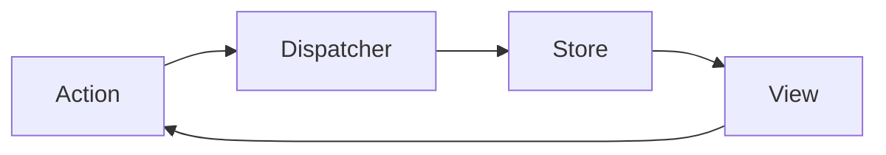
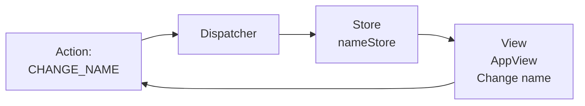
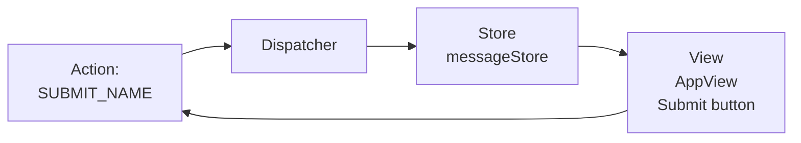

- FLUX의 정보 전달 흐름
- Action : 어떤 기능을 실행 시작한다. 실제 처리는 하지 않는다. Dispatcher에게 넘긴다.
- Dispatcher : Action으로 받은 것을 Store에게 전달 한다.
- Store : 애플리케이션의 상태를 기록한다. 상태가 변경될 때마다 화면 출력에 반영한다. Store 변화시 렌더링을 위해 View가 실행 된다.
- View : Store로 인해 상태가 변경될 때 화면의 출력을 변경합니다. Flux는 View에 리액트를 사용한다.
- FLUX 사용 이유는 복잡한 애플리케이션을 만들 때는 무엇이 어디서 일어나는지 파악하기 힘들다. 하지만 FLUX를 사용하면 어떤 파일에서 어떤 처리가 이뤄지는지 쉽게 파악할 수 있다.
- 따라서 공동 개발때 큰 효과를 발휘하고, 어떤 코드가 사용되는지 쉽게 파악되고, 버그도 줄일 수 있다.



## FLUX 예제

- 이름 쓰고 등록 누르면 이름과 메세지가 나온다.
- 2가지 Action이 있다. 이름을 수정할때 실행되는 `CHANGE_NAME`, 등록 버튼 누를때 `SUBMIT_NAME`
- Action이 발생하면 Dispatcher는 액션 실행 사실을 Store에 전달한다.
- Store는 이름과, 메세지를 변경하면 View에 전달된다. 그럼 화면에 적용 짜잔!!!

*파일 구조*
``` js
actions.js
appDispatcher.js
index.js
stores.js
```

- Store, Action부터 생각하자.
- 이름 입력하는 예제이므로 이름과, 이름이 변경할 때 발생할 액션이 필요하다.
- 이름 데이터 : `nameStore`, 이름 변경 액션 `CHANGE_NAME`
- 등록 버튼을 눌러 인사 메시지를 출력한다.
- 메시지 저장 데이터 : `messageStore`, 등록 버튼 액션 `SUBMIT_NAME`

``` js
// 사용할 Store
const nameStore = { name: '', onChange: null }
const messageStore = { message: '', onChange: null }

// 사용할 Action

const ActionType = {
	CHANGE_NAME = 'CHANGE_NAME',
	SUBMIT_NAME = 'SUBMIT_NAME'
}
```

- 아래 그림들은 현재까지 설명한 부분들이다.





- Dispatcher 정의
- `npm install --save flux`
- 페이스북에서 제공하는 `Dispathcer` 클래스의 인스턴스를 생성하는 것이 끝

``` js
import { Dispatcher } from 'flux';
export const appDispatcher = new Dispatcher();
```

- Store 정의
- 사용할 `Store`를 생성한다.
- `Action`과 `Store`를 연결할 수 있게 `Dispathcer`에 콜백 함수를 등록한다.
- `register` 메서드는 Dispathcer에서 `dispatch`메서드를 실행할때 `register`에 등록한 콜백함수들이 실행된다.

``` js
import { appDispatcher } from './appDispatcher';
import { ActionType } from './actions';

// 사용할 Store
export const nameStore = { name: '', onChange: null }
export const messageStore = { message: '', onChange: null }

// Action과 Store 연결, Dispathcer에 콜백 함수 등록
appDispatcher.register(payload => {
  if (payload.actionType === ActionType.CHANGE_NAME) {
    nameStore.name = payload.value;
    nameStore.onChange();
  }
});

appDispatcher.register(payload => {
  if(payload.actionType === ActionType.SUBMIT_NAME) {
    messageStore.message = nameStore.name + '님 안녕하세요.';
    messageStore.onChange();
  }
});
```

- Action 정의
- `ActionType` 정의하기
- 정의한 `ActionType`을 `Dispatcher`에 전달하기 위한 메서드 정의하기
- Store 정의 부분에서 언급한 `disptach`메서드가 샐행되어 `register`에 등록된 콜백 함수를 모두 실행한다.
- 이때 `dispatch`에 지정한 매개변수가 전달된다.(`{ actionType, value }`)

``` js
import {appDispatcher} from './appDispatcher';

export const ActionType = {
  CHANGE_NAME : 'CHANGE_NAME',
  SUBMIT_NAME : 'SUBMIT_NAME'
}

// Actions을 생성하고 ... Dispatcher에 정보를 전달합니다.
export const Actions = {
  changeName: name => {
    if (name === null) return
    appDispatcher.dispatch({
      actionType: ActionType.CHANGE_NAME,
      value: name
    });
  },
  submitName: () => {
    appDispatcher.dispatch({
      actionType: ActionType.SUBMIT_NAME
    });
  }
}
```

- View 정의

``` js
import React, { Component } from 'react';
import ReactDOM from 'react-dom';
import { Actions } from './actions';
import { nameStore, messageStore } from './stores';

class AppView extends Component {
  constructor (props) {
    super(props);
    this.state = { name: '', message: '' }
    nameStore.onChange = () => {
      this.setState({name: nameStore.name});
    }
    messageStore.onChange = () => {
      this.setState({message: messageStore.message});
    }
  }

  render () {
    console.log('View.render');

    return (
      <div>
        <div>
          <input
            value={this.state.name}
            onChange={e => Actions.changeName(e.target.value)} />
          <button onClick={() => Actions.submitName()}>등록</button>
        </div>
        <div>{this.state.message}</div>
      </div>
    )
  }
}

ReactDOM.render(<AppView />, document.getElementById('root'));
```

### CHANGE_NAME 액션 타입 실행 순서

1. 이름 변경할때 action 발생
``` js
<input
  value={this.state.name}
  onChange={e => Actions.changeName(e.target.value)} />
```
2.  actions.js 에서 ActionType을 Disptacher(`dispatch`메서드 실행)에 전달
3.  `dispatch`메서드를 실행하면 store.js에 `register`메서드가 모두 실행된다.
4.  `dispatch`의 인자값을 `payload`로 받아 `payload.actionType`에 맞는 부분을 실행하여 상태를 변경한다.
5.  `nameStore.onChange()`를 통해 `setState`가 실행되어 View가 렌더링된다.


## 결론

- FLUX를 이용하면 프로그램을 간략하게 유지할 수 있다.
- FLUX에서는 Action -> Dispatcher -> Store -> View처럼 정보가 한 방향으로 흐릅니다.
- FLUX를 이용해 프로그램을 만들 때는 각 처리가 각각의 역할을 넘지 않게 구현해주세요.
